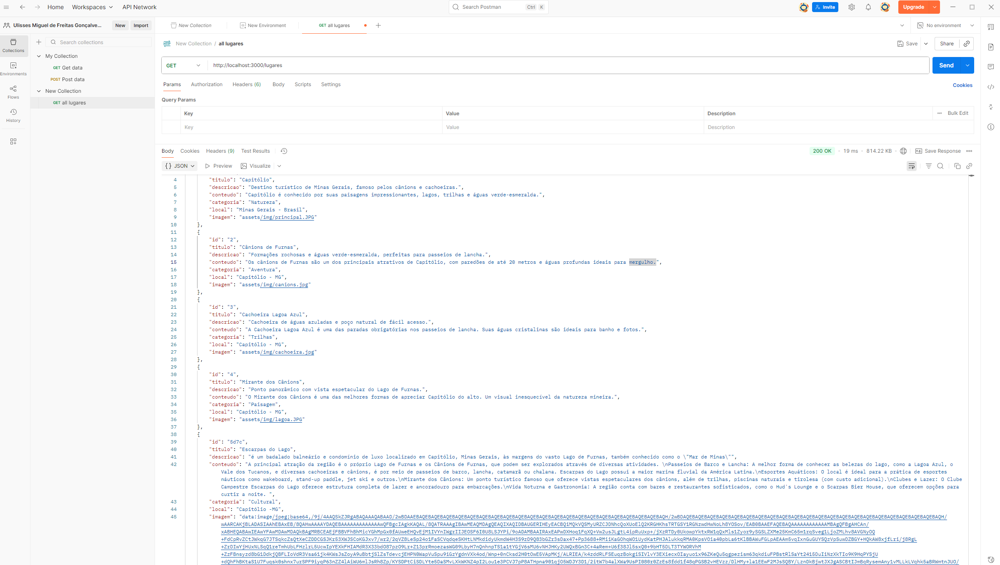
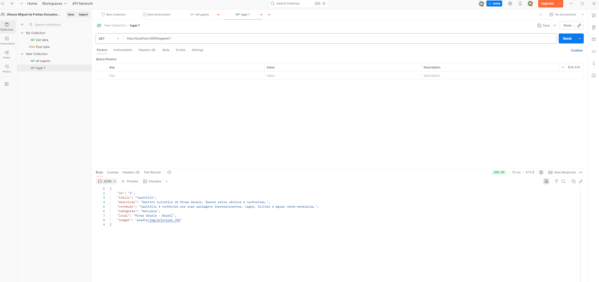
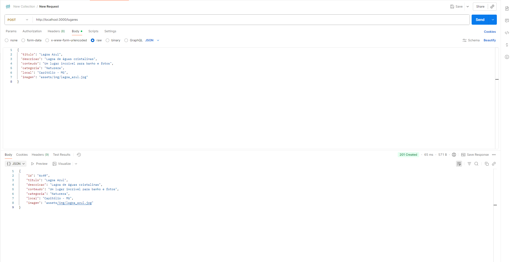
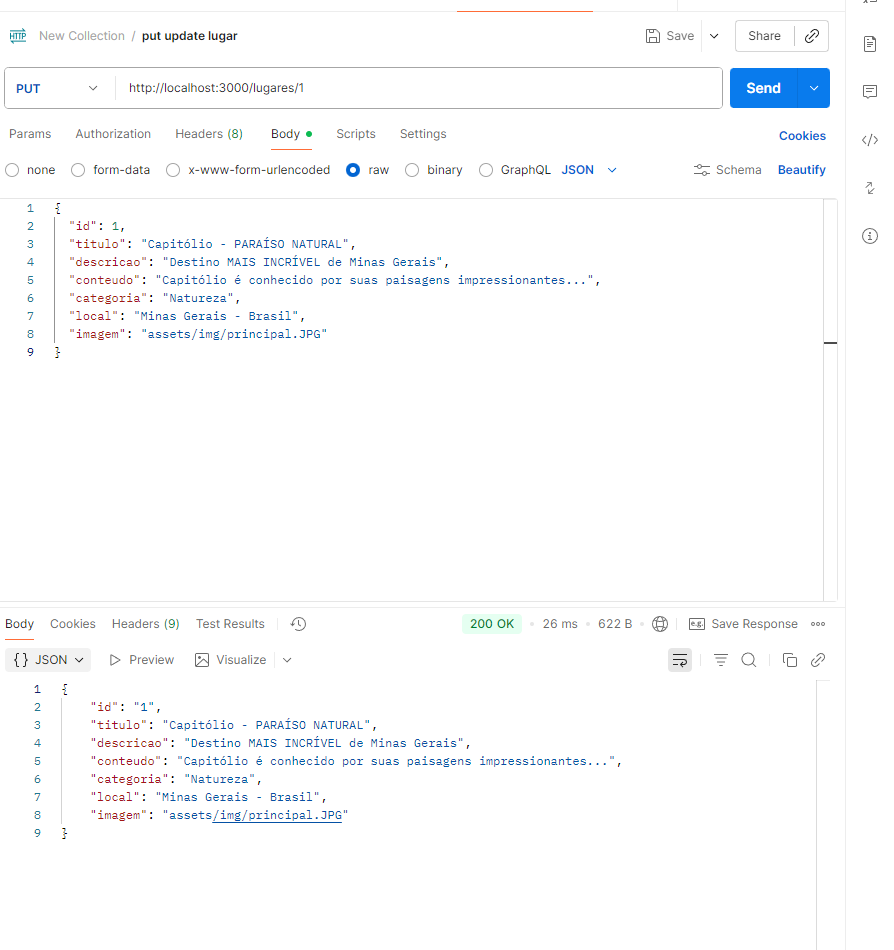
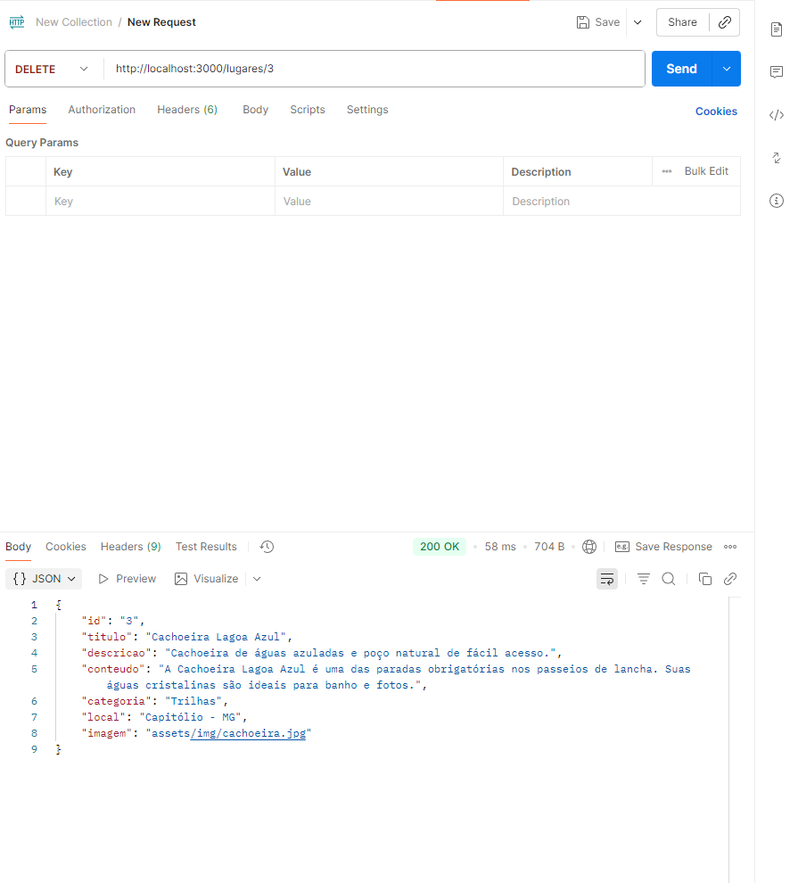

Trabalho Prático 06 - Semanas 11 e 12
Nessa etapa, você irá evoluir o projeto anterior e montando um ambiente de desenvolvimento mais completo, típico de projetos profissionais. Nesse processo, vamos utilizar um servidor backend simulado com o JSON Server que fornece uma APIs RESTful a partir de um arquivo JSON.

Para esse projeto, além de mudarmos o JSON para o JSON Server, vamos permitir o cadastro e alteração de dados da entidade principal (CRUD).

Informações do trabalho
Nome: Ulisses Miguel de Freitas Gonçalves

Matricula: 901839

Proposta de projeto escolhida: A proposta escolhida foi "Lugares e Experiências", com foco na cidade de Capitólio MG, conhecida como um dos principais destinos turísticos de Minas Gerais

Breve descrição sobre seu projeto: Criei um site informativo da cidade de Capitólio MG, onde mostra atrações turísticas, aluguéis de casas, eventos na cidade, aluguéis de lancha e melhores preços. A ideia central foi criar uma home page interativa e informativa que apresenta as principais atrações, passeios e experiências disponíveis na região, servindo como um guia rápido para visitantes. A home page foi organizada com uma estrutura semântica e visual agradável, contendo: Banner de destaque com chamada principal para explorar Capitólio, seção com as principais atrações turísticas (Cânions de Furnas, Mirante dos Cânions, Cachoeiras), cada uma acompanhada de imagem, título, descrição e link para mais detalhes, formulário para inscrição em lista de informações e novidades, e rodapé com informações básicas sobre o site e contatos.

Evolução do Projeto - TP2
Principais Implementações Realizadas:
Migração para JSON Server:

Criação do arquivo db/db.json com estrutura de dados dos lugares

Implementação de API RESTful completa

Configuração do ambiente de desenvolvimento com npm start

Sistema CRUD Completo:

CREATE: Cadastro de novos lugares através do formulário

READ: Listagem e visualização de detalhes dos lugares

UPDATE: Edição de lugares existentes

DELETE: Exclusão de registros

Sistema de Gerenciamento de Imagens:

Upload de imagens com preview em tempo real

Suporte a Data URLs (base64) para imagens enviadas

Seleção de imagens existentes da pasta assets

URL personalizada para imagens externas

Validação de tipo e tamanho de arquivo

Interface Aprimorada:

Página de cadastro/edição (cadastro_lugar.html)

Navegação entre páginas

Design responsivo com Bootstrap

Feedback visual para usuário

Estrutura de Dados Implementada:
json
{
  "lugares": [
    {
      "id": 1,
      "titulo": "Capitólio",
      "descricao": "Destino turístico de Minas Gerais, famoso pelos cânions e cachoeiras.",
      "conteudo": "Capitólio é conhecido por suas paisagens impressionantes, lagos, trilhas e águas verde-esmeralda.",
      "categoria": "Natureza",
      "local": "Minas Gerais - Brasil",
      "imagem": "assets/img/principal.JPG"
    }
  ]
}
Endpoints da API Desenvolvidos:
GET /lugares - Lista todos os lugares

GET /lugares/:id - Busca lugar específico

POST /lugares - Cria novo lugar

PUT /lugares/:id - Atualiza lugar existente

DELETE /lugares/:id - Exclui lugar

Funcionalidades JavaScript Implementadas:
carregarLugares() - Carrega e exibe cards na página inicial

carregarDetalhes() - Exibe detalhes completos de um lugar

initCadastro() - Gerencia formulário de cadastro/edição

salvarLugar() - Salva dados (POST/PUT)

excluirLugar() - Remove registro (DELETE)

initImageHandler() - Gerencia upload e preview de imagens

normalizeImagePath() - Normaliza caminhos de imagem (suporte base64)

Tecnologias Utilizadas:
Frontend: HTML5, CSS3, JavaScript ES6+, Bootstrap 5.3

Backend: JSON Server (API REST simulada)

Ferramentas: npm, Git, Postman (para testes)

Como Executar o Projeto:
bash
# Instalar dependências
npm install

# Iniciar servidor de desenvolvimento
npm start

# Acessar o site
# Frontend: http://localhost:3000
# API: http://localhost:3000/lugares
Próximas Evoluções Possíveis:
Sistema de autenticação de usuários

Upload real de arquivos para servidor

Sistema de favoritos

Integração com APIs de mapas

Sistema de comentários e avaliações

Paginação de resultados

Busca e filtros avançados .

## **Print dos testes da API com Postman**

### GET - Listar todos os lugares

### GET - Buscar lugar específico por ID

### POST - Criar novo lugar

### PUT - Atualizar lugar existente

### DELETE - Excluir lugar

Orientações Gerais
Nesse projeto você vai encontrar a seguinte estrutura base:

Pasta db
Essa pasta contem um único arquivo: db.json. Esse arquivo serve de banco de dados simulado e nele você deve colocar as estruturas de dados que o seu projeto manipula.

OBS: Já incluímos a estrutura de usuários como exemplo e para que você possa utlizar no seu projeto. Se precisar, faça os ajustes necessários para seu projeto.

Pasta public
Nesta pasta você deve colocar todos os arquivos do seu site (front end). Aqui vão os arquivos HTML, CSS, JavaScript, imagens, vídeos e tudo o mais que precisar para a interface do usuário.

Arquivo README.md
Este arquivo em que são colocadas as informações de quem está desenvolvendo esse projeto e os registros solicitados no enunciado da tarefa.

Arquivo .gitignore
Configuração do que deve ser ignorado pelo git evitando que seja enviado para o servidor no GitHub.

Arquivo package.json
Considerado o manifesto do projeto ou arquivo de configuração. Nesle são incluídas as informações básicas sobre o projeto (descrição, versão, palavras-chave, licença, copyright), a lista de pacotes dos quais o projeto depende tanto para desenvolvimento quanto execução, uma lista de do projeto, scripts entre outras opções.

OBS: Esse arquivo é criado assim que o projeto é iniciado por meio do comando npm init.

OBS2: Esse arquivo já traz a informação de necessidade do JSONServer.

Pasta node_modules
Local onde ficam os pacotes dos quais o projeto depende. Evite enviar essa pasta para o repositório remoto. Essa pasta é reconstruída toda vez que se executa o comando npm install.

Ambiente de Desenvolvimento (IMPORTANTE)

A partir de agora, NÃO utilizamos mais o LiveServer/FiveServer durante o processo de desenvolvimento. O próprio JSONServer faz o papel de servidor.

Para iniciar o JSONServer e acessar os arquivos do seu site, siga os seguintes passos:

Abra a pasta do projeto dentro da sua IDE (por exemplo, Visual Studio Code)

Abra uma janela de teminal e certifique-se que a pasta do terminal é a pasta do projeto

Execute o comando npm install
Isso vai reconstruir a pasta node_modules e instalar todos os pacotes necessários para o nosso ambiente de desenvolvimento (Ex: JSONServer).

Execute o comando npm start
Isso vai executar o JSONServer e permitir que você consiga acessar o seu site no navegador.

Para testar o projeto:

Site Front End: abra um navegador e acesse o seu site pela seguinte URL:
http://localhost:3000

Site Back End: abra o navegador e acesse as informações da estrutura de usuários por meio da API REST do JSONServer a partir da seguinte URL:
http://localhost:3000/usuarios

Ao criar suas estruturas de dados no arquivo db.json, você poderá obter estes dados através do endereço: http://localhost:3000/SUA_ESTRUTURA, tal qual como foi feito com a estrutura de usuários. IMPORTANTE: Ao editar o arquivo db.json, é necessário parar e reiniciar o JSONServer.

IMPORTANTE: Assim como informado anteriormente, capriche na etapa pois você vai precisar dessa parte para as próximas semanas. 

IMPORTANTE: Você deve trabalhar:

na pasta public, para os arquivos de front end, mantendo os arquivos index.html, detalhes.html, styles.css e app.js com estes nomes, e

na pasta db, com o arquivo db.json.

Deixe todos os demais arquivos e pastas desse repositório inalterados. PRESTE MUITA ATENÇÃO NISSO.